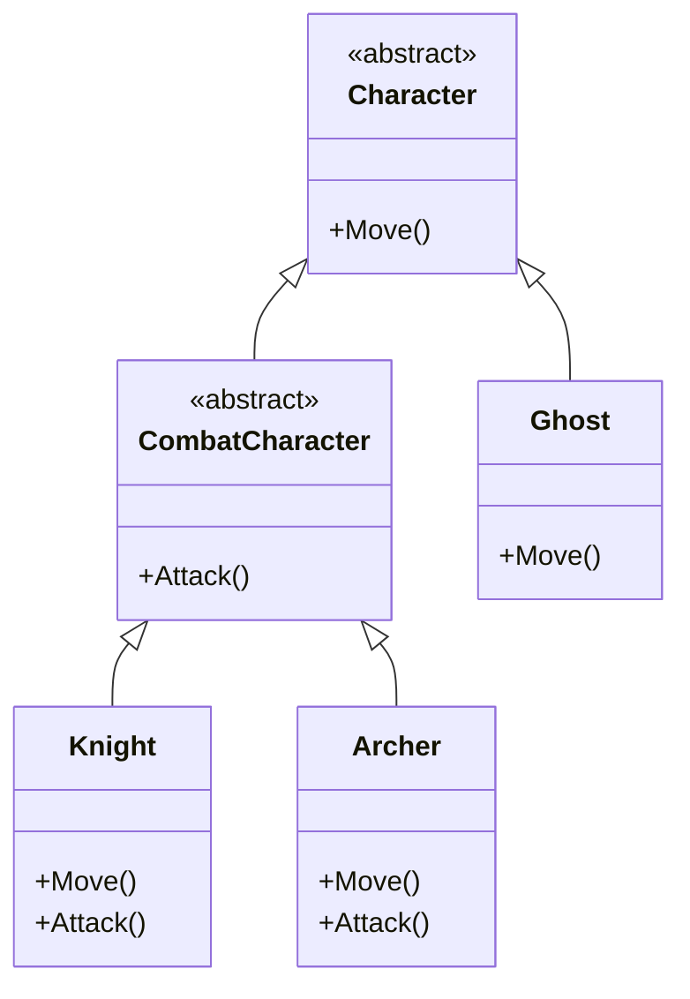

# SOLID Principles - Liskov Substitution Principle (LSP)

> **📍 Location**: `Good-Practices/01-SOLID-Principles/04-SOLID-LSP.md`
> **🔗 See Also**: [SOLID Introduction](01-SOLID-Introduction.md)

## **Definition**

Derived classes must be substitueble for ther base classes without altering the correctess of the program. In other words, objects of a superclass should be replaceable with objects of a subclass without affecting the functionality of the program.

---

## **Objective**

To ensure that inheritance is used correctyly, maintaining the expected behavior of the base class in all derived classes.

---

## **Benefits**

| Benefit | Impact in Unity Projects |
| ------- | ------------------------ |
| **Consistency** | Ensures that derived classes adhere to the contract defined by the base class |
| **Reusability** | Promotes code reuse through inheritance while maintaining reliablity |
| **Maintainability** | Reduces the risk of introducing bugs when extending funcionality |

---

## **Common Pitfalls**

- **Violating the Base Class Contract**: derived classes that change the expected behavior of the base class.
- **Overriding Methods Incorrectly**: modifying the behavior of overridden methods in a way that breaks the base class's logic.
- **Adding Unsupported Features**: introducing new methods or properties in derived classes that the base class doesn't support.

---
  
## **Additional Notes**

### 🧠 Mental Model

- **Real-World Analogy**: think of LSP like a power socket. You can plug in any device (derived class) that adheres to the socket's interface (base class), and it should work without causing issues. If a device doesn't fit or behaves unexpectedly, it violates the principle.

### ⚡ When to Apply

- **When to apply**: use LSP whenever you use inheritance. It's especially important in large systems where derived classes must seamlessly replace base classes.

---

## Unity Example: LSP in Action

### 🎮 **Scenario**: Character Types

Imagine you're developing a game with differents types of charactes. Each character can move and attack, but they do so in different ways. You want to ensure that any character can be substituted for another without breaking the game.

#### ❌ Before LSP

```csharp
public class Ghost : Character
{
    public override void Attack()
    {
        throw new NotImplementedException("Ghosts can't attack");
    }
}
// This breaks LSP because the GameManager expects all Characters to be able to attack.
```

#### ✅ After LSP

1. Define a Base Class for Characters:

    ```csharp
    public abstract class Character : MonoBehaviour
    {
        public abstract void Move();
    }

    public abstract class CombatCharacter : Character
    {
        public abstract void Attack();
    }
    // Now Ghost inherits from Character, and Knight/Archer from CombatCharacter
    ```

1. Create Derived Classes:

    ```csharp
    public class Knight : CombatCharacter
    {
        public override void Move()
        {
            Debug.Log("Knight moves forward");
        }

        public override void Attack()
        {
            Debug.Log("Knight swings a sword.");
        }
    }

    public class Archer : CombatCharacter
    {
        public override void Move()
        {
            Debug.Log("Archer moves stealthily");
        }

        public override void Attack()
        {
            Debug.Log("Archer shoots an arrow.");
        }
    }

    public class Ghost : Character
    {
        public override void Move()
        {
            Debug.Log("Ghosts moves araond");
        }
    }
    ```

1. Use Characters in a Game Manager:

    ```csharp
    public class GameManager : MonoBehaviour
    {
        private List<Character> _characters = new List<Character>();

        void Start()
        {
            _characters.Add(new Knight());
            _characters.Add(new Archer());
            _characters.Add(new Ghost());

            foreach (var character in _characters)
            {
                character.Move();
                if (character is CombatCharacter combatCharacter)
                {
                    combatCharacter.Attack();
                }
            }
        }
    }
    ```

1. Add a New Character Without Breaking the System:

    ```csharp
    public class Mage : CombatCharacter
    {
        public override void Move()
        {
            Debug.Log("Mage teleports.");
        }

        public override void Attack()
        {
            Debug.Log("Mage casts a spell.");
        }
    }
    ```

#### Visual Diagram



#### 🛠️ Implementation Notes

1. **Validation in Editor**:

    ```csharp
    #if UNITY_EDITOR
    void OnValidate()
    {
        if (TryGetComponent<Character>(out var character))
        {
            if (character is IAttacker attacker)
            {
                if (GetComponent<Weapon>() == null)
                    Debug.LogError("Missing Weapon Component!", this);
            }
        }
    }
    #endif
    ```

1. **Use with ScriptableObjects**

    ```csharp
    [CreateAssetMenu]
    public class CharacterState : ScriptableObject
    {
        public float moveSpeed;
        public bool canAttack; // LSP filter
    }
    ```

---

## **Benefits of LSP in Unity**

- **Interchangeability**: you can replace any character with another (e.g., `Knight`, `Archer`, `Mage`) without breaking the game logic.
- **Extensibility**: adding new character types is easy and doesn't requiere changes to existing code.
- **Reliability**: ensures that all characters behave as expected, maintaining the game's integrity.
- **Safe Prefabs**: you can replace prefabs at design time knowing that they will work.
- **Object Pooling**: object pools can return any subtype without additional verification.
- **Reusable AI**: AI systems like NavMeshAgent work with any Character.

---

## **Pro-Tips**

1. **Rule of "Is-A"**: if saying "[Subclass] is-a [Base]" sounds weird (e.g. "Ghost is-a CombatCharacter"), you probably violate LSP.
1. **Substitution Test**: in tests, systematically replace the base class with derivates and verify that everything works.
1. **Exception Solutions**:
    - If a subclass cannot implement a method:

    ```csharp
    public override void Attack()
    {
        Debug.LogWarning("This character doesn't attack");
        // Instead of throwing exception
    }
    ```

1. **Inheritance Alternative**:
    - Use composition when LSP is hard:

    ```csharp
    public class Ghost : Character
    {
        [SerializeField] private PacifyAbility pacify; // <- New Funcionality
    }
    ```

---

[Next >>: Interface Segregation Principle (ISP)](05-SOLID-ISP.md) // [<< Back: Open/Close Princple (OCP)](03-SOLID-OCP.md)
