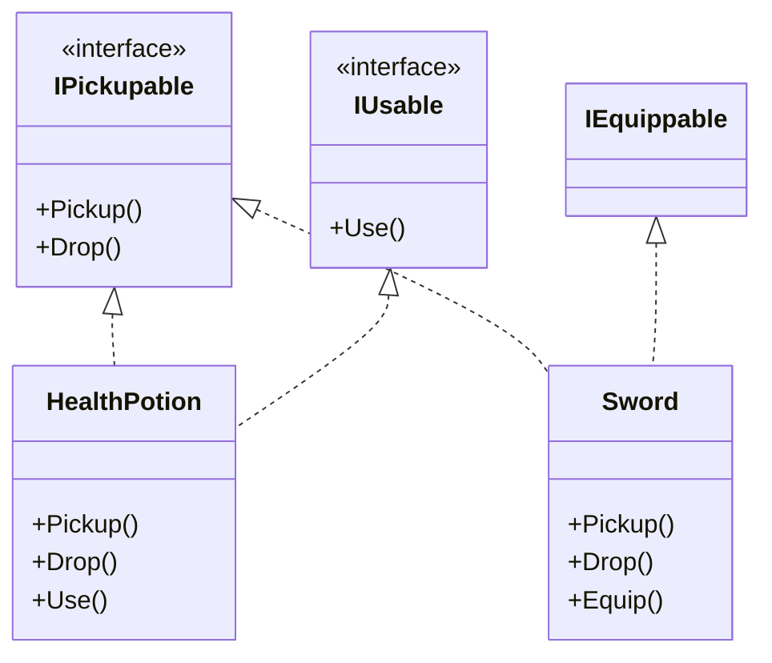

# SOLID Principles - Interface Segregation Principle (ISP)

> **📍 Location**: `Good-Practices/01-SOLID-Principles/05-SOLID-ISP.md`
> **🔗 See Also**: [SOLID Introduction](01-SOLID-Introduction.md)

## **Definition**

Clients should not be forced to depend on interfaces they do not use. Instead of one large interface, prefer many small, specific ones.

---

## **Objective**

- Prevent "fat interfaces" that force classes to implement irrelevant methods.
- Reduce coupling between systems.
- Make interfaces more focused and self-documenting.

---

## **Benefits**

| Benefit | Impact in Unity Projects |
| ------- | ------------------------ |
| 🧩 **Modularity** | Scripts only implement what they need (e.g., `IMoveble` for movement) |
| 🚫 **No Empty Methods** | Elminates `NotImplementedException` in classes |
| 🔍 **Clearer Intent** | Interfaces like `IDamageable` reveal purpose at a glance |
| 🧪 **Easier Testing** | Mocking smaller interfaces is simpler |

---
  
## **Common Pitfalls**

### The "God Interface" Anti-Pattern

```csharp
// DON'T: One interface forcing unrelated methods
public interface ICharacter
{
  void Move();
  void Attack();
  void Talk();
  void Die();
  void PlayAnimation();
}
```

## **Other Pitfalls**

- **Over-Segmentation**: creating interfaces like `ILeftArmMovement` for trivial features.
- **Interface Chains**: excessive inheritance between interfaces (`IMovable` > `IGroundMovement` > `ISprinting`).

---

## **Additional Notes**

### 🧠 Mental Model

Think of ISP like a **toolbox**:

- **Hammer Interface**: only does hammer things (`Strike()`, `PullNail()`).
- **Screwdriver Interface**: only does screwdriver things (`Rotate()`, `ChangeHead()`).

In Unity terms:

- `IMovable` --> Just movement.
- `IInteractable` --> Just interaction.
- `IDamageable` --> Just health

### ⚡ When to Apply

1. When implementing interfaces results in empty/unused methods.
1. When different systems need partial access to an object's features.
1. When working with **third-party SDKs** where you can't modify base interfaces.

---

## Unity Example: ISP in Action

### 🎮 **Scenario**: Gane Items System

#### ❌ Before ISP

```csharp
public interface IGameItem
{
  void Pickup();
  void Drop();
  void Use();
  void Equip();
  void Sell();
}

// Problem: a consumable must implement Equip() even if unnecessary
public class HealthPotion : IGameItem
{
  public void Equip() { /* Empty - Potion can't be equipped */ }
}
```

#### ✅ After ISP

1. **Segregate Interfaces**:

    ```csharp
    public interface IPickupable
    {
      void PickUp();
      void Drop();
    }

    public interface IUsable
    {
      void Use();
    }

    public interface IEquippable
    {
      void Equip();
    }

    public interface ISelleable
    {
      void Sell();
    }
    ```

1. **Implement Only What's Needed**:

    ```csharp
    // Health Potion
    public class HealthPotion : MonoBehaviour, IPickupable, IUsable, ISellable
    {
      public void Pickup() { /* ... */ }
      public void Drop() { /* ... */ }
      public void Use() { /* ... */ }
      public void Sell() { /* ... */ }
    }

    // Sword
    public class Sword : MonoBehaviour, IPickupable, IEquippable, ISellable
    {
      public void Pickup() { /* ... */ }
      public void Drop() { /* ... */ }
      public void Equip() { /* ... */ }
      public void Sell() { /* ... */ }
    }
    ```

1. **Systems Use Specific Interfaces**:

    ```csharp
    // Inventory system only cares about pickup/drop
    public class InventorySystem
    {
      public void AddItem(IPickupable item)
      {
        item.Pickup();
      }
    }

    // Shop system only needs sellable items
    public class ShopSystem
    {
      public void SellItem(ISellable item)
      {
        item.Sell();
      }
    }
    ```

#### Visual Diagram



#### 🛠️ Implementation Notes

1. **Unity-Specific Tips:**
    - Use `GetComponent<Interface>()` to check for capabilites:

    ```csharp
    if (item.TryGetComponent<IUsable>(out var usableItem))
    {
      usableItem.Use();
    }
    ```

    - Tag interfaces with attributes for editor filtering:

    ```csharp
    [AttributeUsage(AttributeTargets.Interface)]
    public class GameSystemAttribute : Attribute { }

    [GameSystem]
    public interface IInteractable { }
    ```

1. **ScriptableObject Integration:**

```csharp
[CreateAssetMenu]
public class ItemData : ScriptableObject
{
  public bool usable;
  public bool equipable;
  // Enables data-driven interface assignment
}
```

---

## **Benefits of ISP in Unity**

1. **Cleaner Prefabs**: components only implement relevant interfaces.
1. **Better Performance**: no unnecessary method calls or null checks.
1. **Mod Support**: modders can add new items without understanding entire systems.
1. **Editor Clarity**: custom inspectors can show interface-specific options.

---

## **Pro-Tips**

1. **Naming Convention**: prefix interfaces with `I` + `Capability` (e.g., `IDamageable`, `ISaveable`).
1. **Interface Composition**:

    ```csharp
    public class AdvancedSword : MonoBehaviour, IPickupable, IEquippable, IEnchantable { /* ... */ } 
    ```

1. **Debugging**:

    ```csharp
    [RequitedComponent(typeof(Rigidbody))]
    public class PhysicsItem: MonoBehaviour, IPickupable { /* ... */ }
    ```

1. **Alternative to ISP**: for simple cases, consider Unity's `[SerializeField]` bools to toggle features instead of interfaces.

---

[Next >>: Dependency Inversion Principle (DIP)](06-SOLID-DIP.md) // [<< Back: Liskov Substitution Principle (LSP)](04-SOLID-LSP.md)
