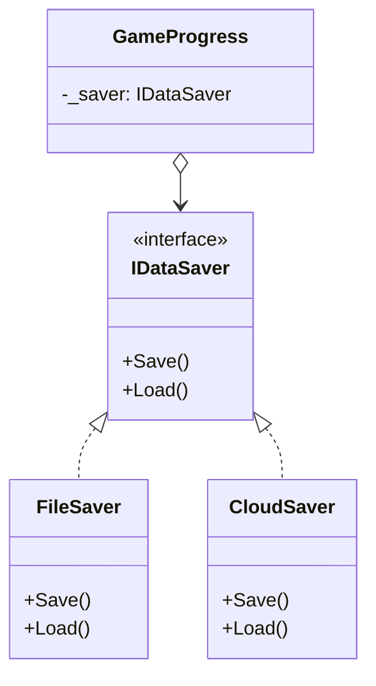

# SOLID Principles - Dependency Inversion Principle (DIP)

> **📍 Location**: `Good-Practices/01-SOLID-Principles/06-SOLID-DIP.md`  
> **🔗 See Also**: [SOLID Introduction](01-SOLID-Introduction.md)

## **Definition**

1. High-level modules should not depend on low-level modules. Both should depend on abstractions.
1. Abstractions should not depend on details. Details should depend on abstractions.

---

## **Objective**

- Decouple systems to allow independent development and testing.
- Enable easier swapping of implementations (e.g., mock services for testing).
- Facilitate code reuse across projects.

---

## **Benefits**

| Benefit | Impact in Unity Projects |
|---------|--------------------------|
| 🧪 **Testability** | Mock dependencies in Play Mode tests |
| 🔄 **Modularity** | Swap SDKs or plugins without refactoring |
| 🛠️ **Maintainability** | Change implementations without affecting consumers |
| 🌐 **Multiplatform** | Different implementations per platform (PC/Mobile/XR) |

---

## **Common Pitfalls**

### ❌ Direct MonoBehaviour References

```csharp
// DON'T: High-level class depends directly on concrete implementation
public class AchievementSystem : MonoBehaviour
{
    private SteamAchievements _steamAPI; // Concrete dependency
    void Start()
    {
        _steamAPI = GetComponent<SteamAchievements>();
    }
}
```

### 🚧 **Other Anti-Patterns**

- Using `new()` for service instantiation inside classes.
- Direct `GetComponent<>()` calls for critical dependencies.
- Singleton overuse instead of dependency injection.

---

## **Additional Notes**

### 🧠 **Mental Model**

Think of DIP like a **universal charger**:

- Your phone (high-level) depends on the USB-C *standard* (abstraction).
- Not on specific charger brands (implementations).
- You can swap chargers without modifying your phone.

### ⚡ **When to Apply**

1. When integrating third-party SDKs (Ads, Analytics, etc.).
1. For systems that need platform-specific implementations.
1. When writing unit tests that require mocks.

---

## **Unity Example: DIP in Action**

### 🎮 **Scenario**: Save System

#### ❌ **Before DIP**

```csharp
public class GameProgress
{
    private BinaryFileSaver _saver = new BinaryFileSaver(); // Direct dependency
    
    public void SaveData()
    {
        _saver.SaveToFile("game.dat"); // Tied to file system
    }
}
```

#### ✅ **After DIP**

1. **Define Abstraction**:

```csharp
public interface IDataSaver
{
    void Save(string data);
    string Load();
}
```

1. **Implementations**:

```csharp
// File System Implementation
public class FileSaver : MonoBehaviour, IDataSaver
{
    public void Save(string data)
    {
        File.WriteAllText("game.dat", data);
    }
}

// Cloud Save Implementation
public class CloudSaver : MonoBehaviour, IDataSaver
{
    public void Save(string data)
    {
        PlayGamesPlatform.Instance.SaveGame(data);
    }
}

// Editor Mock Implementation
#if UNITY_EDITOR
public class MockSaver : IDataSaver
{
    public void Save(string data)
    {
        Debug.Log($"Mock Save: {data}");
    }
}
#endif
```

1. **Consumer Class**:

```csharp
public class GameProgress : MonoBehaviour
{
    [SerializeField] private IDataSaver _saver; // Inspector-assigned

    public void SaveData()
    {
        _saver.Save(JsonUtility.ToJson(data));
    }
}
```

#### 🛠️ **Implementation Methods in Unity**

| Method | Pros | Cons |
|--------|------|------|
| **Inspector Assignment** | Simple, visual workflow | Manual setup |
| **Dependency Injection** | Automated, testable | Requires framework |
| **Service Locator** | Centralized access | Can hide dependencies |

**Recommended Setup**:

```csharp
// Bootstrap class (initializes dependencies)
public class GameInstaller : MonoBehaviour
{
    void Awake()
    {
        // Bind implementation based on platform
        #if UNITY_EDITOR
            Container.Register<IDataSaver>(new MockSaver());
        #elif UNITY_IOS
            Container.Register<IDataSaver>(GetComponent<CloudSaver>());
        #else
            Container.Register<IDataSaver>(GetComponent<FileSaver>());
        #endif
    }
}
```

---

## **Benefits of DIP in Unity**

1. **SDK Swapping**: change analytics providers without modifying game code.
1. **Parallel Development**: artists can work with mock services.
1. **Testing**: replace real services with test doubles.
1. **Asset Reuse**: share systems between projects via interfaces.

---

## **Pro-Tips**

1. **Zenject/Extenject**: Use DI frameworks for complex projects.
1. **ScriptableObject Services**:

   ```csharp
   [CreateAssetMenu]
   public class AudioService : ScriptableObject, IAudioService
   {
       public void PlaySFX(string id) { /* ... */ }
   }
   ```

1. **Editor Mocks**:

   ```csharp
   #if UNITY_EDITOR
   [InitializeOnLoad]
   public static class EditorMocks
   {
       static EditorMocks()
       {
           Container.Register<IAPService>(new EditorIAPMock());
       }
   }
   #endif
   ```

1. **DIP + Strategy Pattern**:

   ```csharp
   public class EnemyAI : MonoBehaviour
   {
       private IAttackStrategy _attackStrategy;
       public void SetStrategy(IAttackStrategy strategy)
       {
           _attackStrategy = strategy;
       }
   }
   ```

---

## **Visual Diagram**



---

[<< Back: Interface Segregation Principle (ISP)](05-SOLID-ISP.md)
